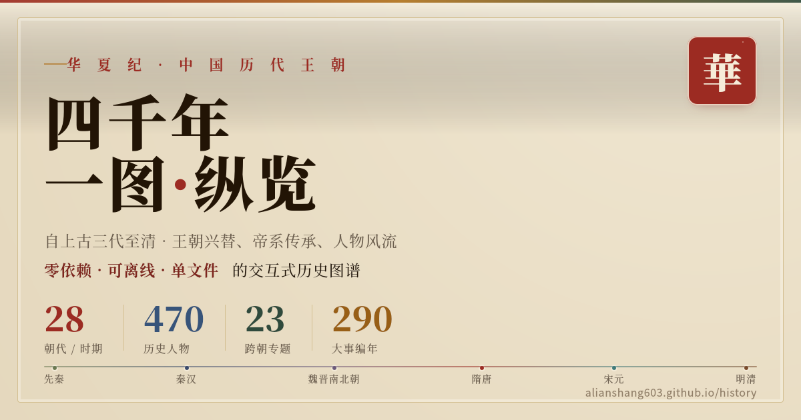
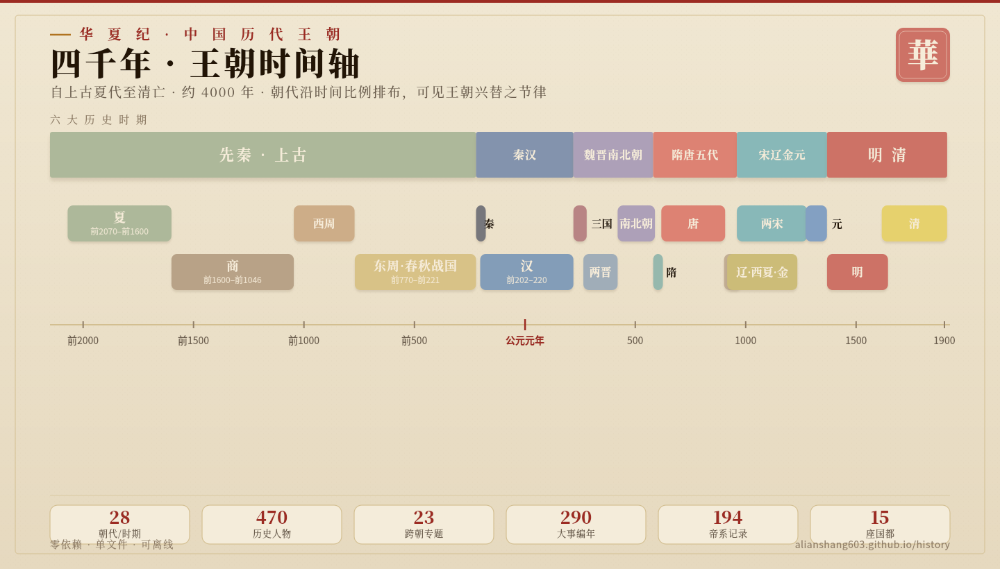
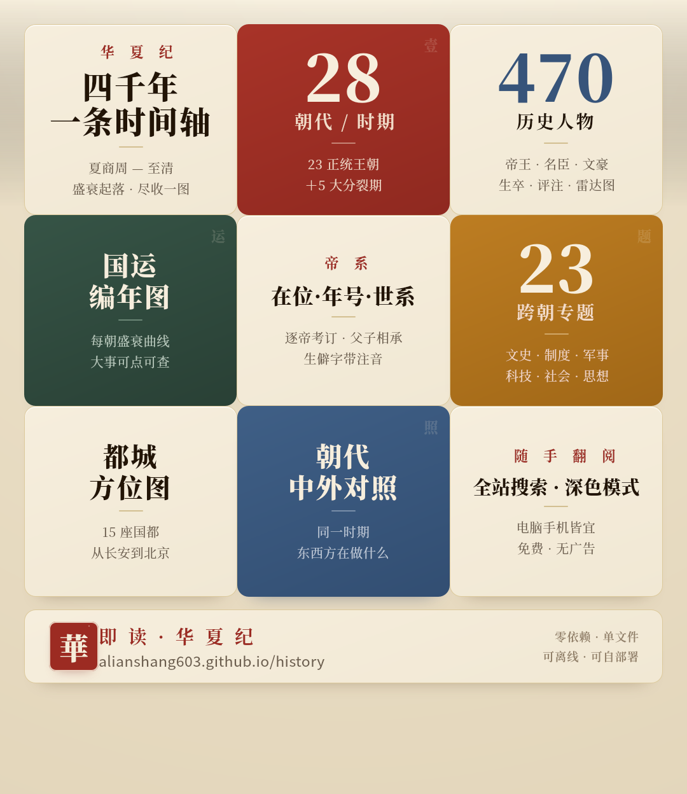

<div align="center">

# HuaxiaJi · Chinese Dynasties Through the Ages

**A complete walk through Chinese history, from the legendary Three Dynasties to the fall of the Qing — a zero-dependency, offline-capable, single-file interactive atlas.**

[简体中文](./README.md) ｜ English


[](./LICENSE)
[](https://alianshang603.github.io/history/)
[](https://alianshang603.github.io/history/)
[](#tech-notes)
[](#tech-notes)
[](#tech-notes)
[](https://github.com/alianshang603/history/stargazers)

A 4,000-year master timeline · 28 dynasty pages · 23 cross-dynasty topics · 470 historical figures · side-by-side comparisons · full-text search · a capital-city map

<br>



</div>

---

## Overview

**HuaxiaJi** compresses nearly four thousand years of Chinese history — from the Xia (c. 2070 BCE) to the fall of the Qing (1912) — into **a single HTML file**. It isn't a long article but an atlas you roam: scroll the master timeline to survey the rise and fall of dynasties, open any dynasty to read it across ten dimensions, follow a single thread across eras by topic (civil-service examinations, economy, literature, territory…), search and compare in the figures library, or watch capital cities shift on the map.

The whole project has **no build step, no framework, and no backend**. Download it and it just works — even offline.

## Gallery

<div align="center">



<br><br>



</div>

## Features

- **Master timeline** — a scrollable, zoomable 4,000-year timeline, color-banded into eras (Pre-Qin · Qin–Han · Wei-Jin & Northern–Southern · Sui–Tang & Five Dynasties · Song–Liao–Jin–Yuan · Ming–Qing), with the ability to focus an era and auto-lane concurrent regimes.
- **28 dynasty / period pages** — each with ten sections: Overview, Rulers, Politics, Economy & Society, Military, Culture, Arts & Letters, Ethnic Relations & Diplomacy, Figures, and Key Scenes. The 5 fragmented periods (Sixteen Kingdoms, Southern Dynasties, Northern Dynasties, Five Dynasties, Ten Kingdoms) also get a composite view of their coexisting regimes.
- **23 cross-dynasty topics** — thematic threads that run horizontally through history, in four groups plus three pinned overviews (see below).
- **470 historical figures** — across six categories (rulers, civil officials, generals, thinkers & artists, science & Western learning, consorts & notable women); filter by era and role, sort by ability dimensions, and compare any two. 34 rulers come with an ability-rating radar.
- **Dynasty comparisons** — 7 sets, both across and along time: concurrent (Wei/Shu/Wu · Song/Liao/Xia/Jin · Southern/Northern), succession (Qin→Han · Sui→Tang · Yuan→Ming), and golden-age side-by-side (Wenjing · Zhenguan · Kaiyuan · Kangxi-Qianlong).
- **Full-text search** — one box to search dynasties, figures, and events (290 dated entries).
- **Historical map** — a schematic of capital cities by era, with provincial outlines of China and the courses of the Yellow and Yangtze Rivers; switch dynasties to see capitals against their modern locations.
- **Light / dark themes** — auto-follows the system preference and remembers a manual choice; the theme is resolved before first paint, so there's no white flash on reload in dark mode.
- **Pinyin for rare characters** — automatic pinyin annotations for hundreds of rare and polyphonic characters in names, place names, and institutional terms.
- **Keyboard-accessible & a11y-aware** — timeline blocks, cards, and links are all tabbable and Enter-activatable; the events dialog supports Esc-to-close, a Tab focus trap, and ← → paging; honors `prefers-reduced-motion`.

## By the numbers

| Dimension | Count |
|-----------|-------|
| Dynasty / period pages | **28** |
| Sections per dynasty | **10** |
| Fragmented periods (composite regime view) | **5** |
| Cross-dynasty topics | **23** |
| Historical figures | **470** |
| Rulers with ability ratings | **34** |
| Comparison sets | **7** |
| Dated chronicle entries | **290** |
| Reign records | **194** |
| Capital-city points on the map | **15** |
| Time span | c. 2150 BCE – 1912 CE |

> Figures by category: rulers 116 · civil officials 113 · generals 102 · thinkers & artists 102 · science & Western learning 29 · consorts & notable women 8.

## Topic list

**Pinned overviews**
- Epochal Turns & Great Transformations (Zhou–Qin shift · Tang–Song transition · ancient-to-modern shift)
- Long-Durée Overview
- China & the World Side by Side

**Institutions & Governance**
- Institutional evolution · Civil-service selection · Military systems · Decisive battles · Statecraft (leadership & organization)

**Economy & Society**
- Economy & population · Capitals & cities · Grassroots society & lineage · Daily life (food, clothing, dwelling, travel)

**Thought & Culture**
- Great literary works through the ages · Currents of thought · Religion & belief · Education & academies · History of art · Idioms & allusions

**Science · Territory · Peoples · Diplomacy**
- History of science · History of medicine · Territorial change · Ethnic integration · Foreign exchange

## Quick start

The project is a single static HTML file with no dependencies to install.

**Option 1: Open it directly**

Download `index.html` (or whatever the file is named in the repo) and double-click to open it in a browser.

**Option 2: Serve it locally** (recommended, to avoid some browsers' `file://` restrictions)

```bash
# Python 3
python3 -m http.server 8000

# or Node
npx serve .
```

Then visit `http://localhost:8000`.

**Option 3: Deploy to GitHub Pages**

1. Name the file `index.html` and push it to your repo.
2. Go to **Settings → Pages** and choose the branch to deploy (e.g. the root of `main`).
3. After a moment it's live at `https://alianshang603.github.io/history/`.

> It also deploys in one click to Cloudflare Pages, Vercel, Netlify, or any static host.

## Tech notes

- **Pure front-end, single file**: HTML + CSS + vanilla JavaScript, all inlined into one file — no bundler, no dependency management, no runtime framework.
- **Only external resource**: the body font, Noto Serif SC, is loaded asynchronously from Google Fonts with a system-serif fallback. **Offline, only the glyph shapes differ slightly; every feature still works.**
- **Routing**: URL-`hash`-based client routing covering 10 page types — home, dynasty index, dynasty page, topics, topic detail, figures, comparison, search, map, and about — with back/forward and shareable anchored links.
- **Graphics**: 30+ visualizations (timeline, radar charts, relationship graphs, the map…) are all hand-authored inline SVG — crisp vectors that recolor with the theme.
- **Rendering**: content is generated on the client from data; interactive lists are debounced and long lists scroll smoothly.

## Browser support

Targets modern browsers (recent Chrome / Edge / Firefox / Safari). It uses newer features such as CSS custom properties, `color-mix()`, `IntersectionObserver`, and `matchMedia`, so a recent browser is recommended for the full experience. Touch and narrow-screen layouts are handled for mobile.

## Project structure

```
.
├── index.html              # everything (markup + styles + script, single file)
├── docs/
│   └── banner/             # overview graphics (hero / timeline poster / feature grid)
├── README.md               # Chinese README
├── README.en.md            # English README (this file)
└── LICENSE                 # open-source license
```

## About the content & scope

- This project is meant as **popular history for a general audience** — clear lines and accurate highlights within a limited space. It is necessarily selective and is no substitute for scholarly monographs or primary sources.
- Dates and figures' birth/death years generally follow mainstream scholarship; where sources disagree or values are approximate, the text marks them with "c." (约) where possible.
- Found a factual error, typo, or wrong pinyin? Please open an Issue.

## Contributing

Issues and pull requests are welcome. Before opening a PR, please make sure that:

- the main pages (timeline, dynasty page, topics, figures, map, search) render correctly when tested in a browser;
- data changes cite their source;
- the project stays single-file and zero-dependency where possible.

## License

Released under the [MIT License](./LICENSE).

> If the historical text and data carry additional usage terms, note them here.

---

<div align="center">
<sub>A history of Chinese literature is also a history of the Chinese heart; may HuaxiaJi be your window onto four thousand years.</sub>
</div>
